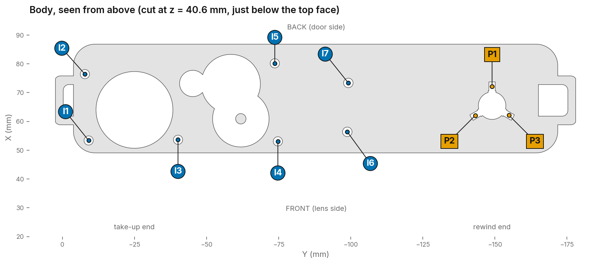
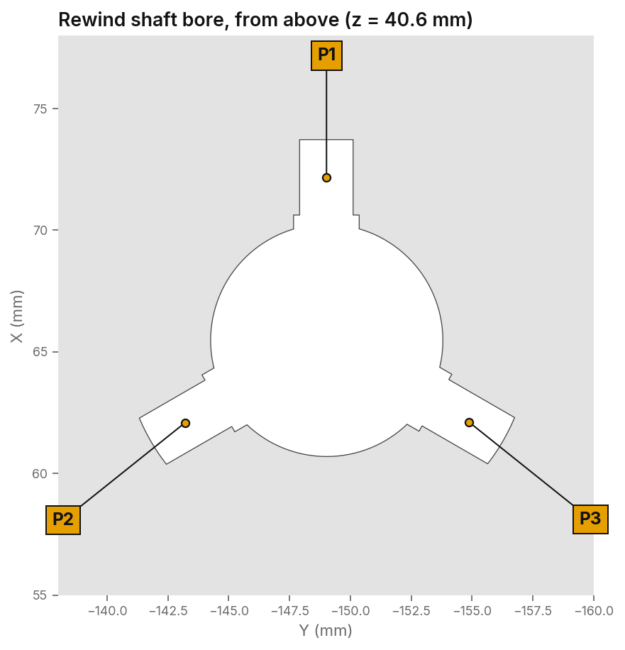
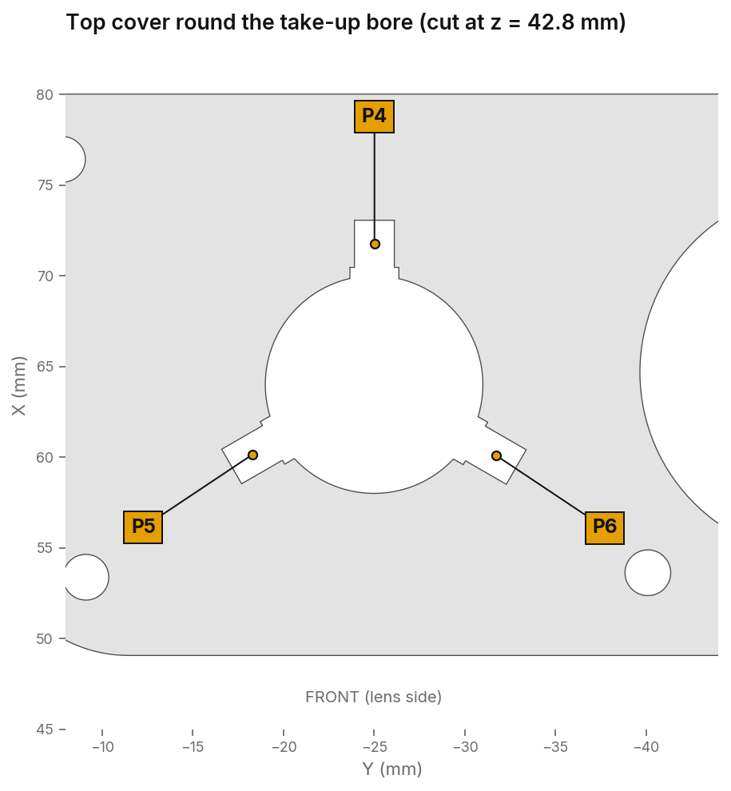
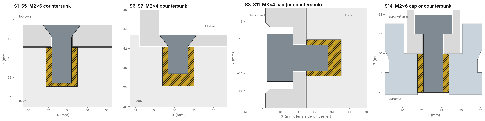
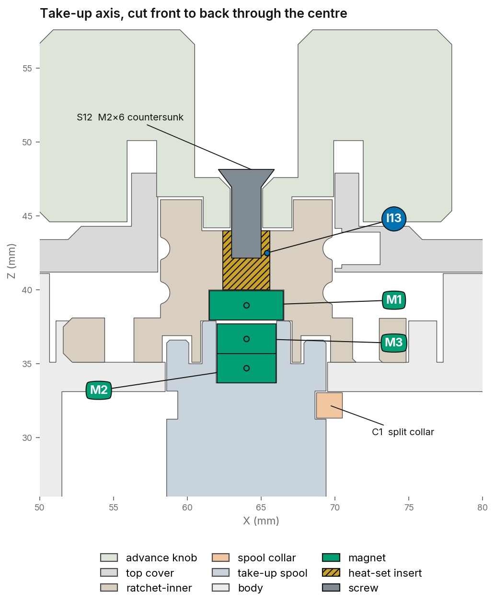
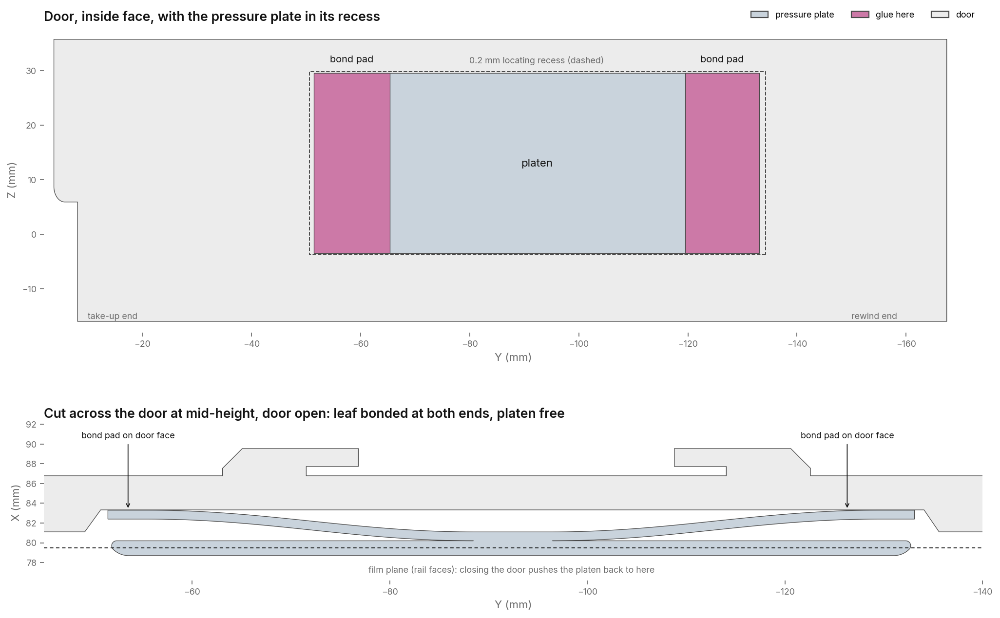

# Infidex 176 V x IDENTIDEM.design Remix

> **This is a remix of someone else's design.** The Infidex 176 V is an open source 3D-printed panoramic 35mm camera by **Denis Aminev (Time to Waste)**. Everything here builds on his work.
>
> - Original project: **[Infidex 176 V on GitHub](https://github.com/max05210238/Infidex_176_V)**
> - Original designer: **[Denis Aminev — Time to Waste on YouTube](https://www.youtube.com/@time_to_waste)**
> - This remix: **[IDENTIDEM.design](https://IDENTIDEM.design)**
>
> Print the original first if you want the camera as Denis designed it. Attribution stays with him; please keep it with any further remix.

## What this remix is

The camera is unchanged where it counts: same 3:1 panoramic frame on 35mm film, same Mamiya TLR taking lens, same overall shape. What changed is how it goes together and how you know where you are on the roll.

| | Original | This remix |
|---|---|---|
| Body | One piece | Reworked, and supplied two ways: in one piece, or as two halves glued together with a light-tight lip and alignment pegs |
| Frame counting | Count as you wind | Sprocket-driven gear train and a numbered counter face, starting at 25 |
| Rewind knob | Spring detent | Three ball plungers |
| Take-up coupling | Dog coupling | Inner-ratchet with three ball plungers for wind and rewind, magnets optional |
| Spool retention | Glued washer | Printed split collar (`takeup-washer-stopper`) that clicks into the groove |
| Pressure plate | Foam | Printed leaf-spring platen, bonded to the door at both ends |
| Fixings | Glue and press fits | Heat-set inserts and screws throughout |
| Viewfinder | Separate | Cold-shoe viewfinder coupled to the focus helicoid |

## Focusing scale generator

**[infidex176v-focus-scale.identidem.design](https://infidex176v-focus-scale.identidem.design/)** makes a focusing scale for your own lens. Give it the focal length, the helicoid thread lead and your focus ring diameter, and it returns the scale as SVG or Gerber, marked from infinity down to 1.44 m, ready to print as a decal or etch as a plate.

## Specifications

Carried over from the original design:

- **Format:** 3:1 panoramic, 72 × 24 mm on 35mm (135) film
- **Frames:** 18 per 36-exposure roll, or 19 if you load in darkness
- **Lens:** Mamiya TLR taking lens, 80mm or 55mm, from the C2/22/220 or C3/33/330 series
- **Body:** about 168 × 67 × 38 mm
- **Filament:** under 600 g for a camera
- **Tripod mount:** 3/8"-16 thread printed straight into the base, five turns and 8.5 mm deep. Most tripods and quick-release plates are 1/4"-20, so fit a 3/8" to 1/4" bushing and leave it in. Start it by hand: a printed thread strips if you drive it with a tool.

Specific to this remix:

- **Frame counter:** 50:1 spur train, module 0.6, four meshes (12:32, 12:30, 12:30, 12:36), one counter-face turn per 25 frames
- **Counter face:** starts at 25 as the loading position, then reads 1, 2, 3 and on as you wind; friction-fitted under a thumbscrew, reset by loosening it and turning 25 back to the marker

## Files

| File | What it is |
|---|---|
| `cad/Infidex176V-IDENTIDEM.design-remix.step` | Full assembly, STEP, for any CAD package |
| `cad/Infidex176V-IDENTIDEM.design-remix.f3d` | Fusion source for the camera |
| `cad/Infidex176V-IDENTIDEM.design-remix-counter-train.f3d` | Fusion source for the parametric counter gear train |
| `3mf/Infidex176V-IDENTIDEM.design-remix.3mf` | Print-ready project, all parts laid out across nine plates |
| `3mf/parts/` | One 3MF per part, for reprinting a single part |
| `Infidex-Hardware-Map.pdf` | Hardware placement and assembly guide, 6 pages |
| `tools/InfidexCounterTrain/` | Fusion script that rebuilds the counter train from parameters, see [`tools/README.md`](tools/README.md) |
| `docs/` | Section drawings used in this README |
| `NOTICE.md` | Denis's redistribution notice, and the remix notice |
| `CHANGELOG.md` | Releases, the commits behind them and which parts to reprint |

## Printing

Print settings follow the original profile and work well in PETG:

- 0.4 mm nozzle, 0.2 mm layer height
- 4 perimeters, up to 25% infill
- Denis printed the original in ABS. PETG works well and is easier to live with
- Both halves of the two-piece body sit flat on their seam face, which puts the largest surface on the bed. Add supports wherever your slicer flags overhangs
- The one-piece body prints as in the original if you would rather not glue

The counter train gears are the finest parts in the model. Print them with the rest of the camera, check the teeth before assembly, and reprint if a tooth is short.

### Parts

Print the whole camera from the project file in `3mf/`, which has everything arranged across nine plates with the per-part settings already set. `3mf/parts/` holds the same 32 parts one to a file, each in the orientation it is meant to print in and sitting on the bed, for when you only need to reprint one.

Some parts are a choice rather than a set. Print one from each of these:

- **Body:** `body-solid`, or `body-top` and `body-bottom` together
- **Door:** `door-var-1` to `door-var-4`
- **Viewfinder:** `viewfinder-var-1` or `viewfinder-var-2`
- **Focus ring:** `helicoid-focus-ring-ribs` or `helicoid-focus-ring-no-ribs`
- **Helicoid inner ring:** `helicoid-inner-ring-for-80mm-lens` or `helicoid-inner-ring-for-55mm-lens`, to suit your taking lens

One file name differs from the words used in the hardware guide: the split collar is `takeup-washer-stopper`.

### Lens mount alternatives

The helicoid in this repo is one of four mounts Denis offers, and the others are worth a look before you commit: **[STL/Lens mount](https://github.com/max05210238/Infidex_176_V/tree/Main/STL/Lens%20mount)** has a classic cone, a tube mount, and an older cone for the T-22 lens alongside the focusing helicoid. The cone and tube install the same way as each other, so swapping is not a big job.

Inside **[STL/Lens mount/Focusing Helicoid](https://github.com/max05210238/Infidex_176_V/tree/Main/STL/Lens%20mount/Focusing%20Helicoid)** there is also a **blue dot set, the `shorter-2mm` files**, which take 2 mm out of the helicoid:

- `Helicoid_FOCUS_ring_ribs_shorter-2mm.stl` or `Helicoid_FOCUS_ring_NO_ribs_shorter-2mm.stl`
- `Helicoid_INNER_ring_80mm_shorter-2mm.stl`

Print the shortened focus ring and inner ring as a pair, not mixed with the full-length ones. The same folder has taller and lower lens boards if your lens will not reach infinity on the standard one.

## Hardware

Everything below was measured from the CAD. [`Infidex-Hardware-Map.pdf`](Infidex-Hardware-Map.pdf) is the same information with section drawings and the exact position of every hole; this README carries the procedure, the PDF carries the coordinates.

### What to buy

| Item | Qty | Where |
|---|---|---|
| M2 × 4 heat-set inserts | 10 | Top cover ×5, cold shoe ×2, counter gear, inner-ratchet, sprocket |
| M3 × 4 heat-set inserts | 4 | Lens standard, front face |
| M2 × 6 countersunk screws | 6 | Top cover ×5, advance knob |
| M2 × 4 countersunk screws | 2 | Cold shoe |
| M3 × 4 cap or countersunk screws | 4 | Lens standard |
| M2 × 6 cap or countersunk screw | 1 | Sprocket gear to sprocket |
| M2 × 4 thumbscrew | 1 | Counter face |
| D2×3 flanged ball plungers | 6 | Rewind bore ×3, take-up bore ×3 |
| Ø5 × 2 magnet | 1 | Inner-ratchet (optional, recommended) |
| Ø4 × 2 magnets | 2 | Take-up spool head (optional, recommended) |
| 3/8" to 1/4" tripod bushing | 1 | Base, in the printed 3/8"-16 socket |

Carried over from Denis's build, not in the printed files, and still needed:

| Item | What for |
|---|---|
| Black flocked self-adhesive paper | Lining the film chambers and the inside of the door to kill reflections and stray light |
| Black light-seal foam | Sealing the door where it closes onto the body |
| Rigid stainless wire, 0.6–0.8 mm | Springs and linkages in the original mechanism |
| Superglue (CA) | Magnets, the pressure plate pads, and the body seam on the two-piece body |

## Assembly

**Read [Denis's assembly guide](https://github.com/max05210238/Infidex_176_V/blob/Main/docs/ASSEMBLY.md) first.** It is the build, start to finish: body, lens mount, film transport, rewind spring and door, finishing parts. What follows here covers only what this remix changes, and assumes you have his guide open beside it.

### Fitting order

1. **All heat-set inserts first** (I1–I11 in the body, I12 in the counter gear, I13 in the inner-ratchet, I14 in the sprocket), before anything else is fitted to those parts. The soldering iron can't then hurt a magnet or loosen a plunger.
2. **Ball plungers** once the body and cover have cooled: P1–P3 in the body's rewind bore, P4–P6 in the cover's take-up bore.
3. **Magnets** (optional, highly recommended), checking polarity before gluing. M1 goes into the inner-ratchet from below, after I13 is in.
4. **Pressure plate into the door.** Let the glue cure before closing the door on it.
5. **Take-up spool and printed collar:** hold the split collar inside the body under the take-up bore, then lower the spool from the top through it until the collar clicks into the groove.
6. **Two-piece body only:** glue the halves together once their inserts, plungers and magnets are in.
7. **Screws:** top cover, cold shoe, lens standard, advance knob, then the counter face.
8. **Flocking and foam last,** after a dry run with the back open. The tripod bushing can go in whenever.

### Heat-set inserts

Fourteen in all, every one 4 mm long in a hole 4.0 mm deep. Buy M3 × 4, not the common 5.7 mm length.

- **I1–I5**, M2, top face, for the top cover
- **I6–I7**, M2, top face, for the cold shoe
- **I8–I11**, M3, front face, for the lens standard
- **I12**, M2, counter gear hub
- **I13**, M2, top of the inner-ratchet
- **I14**, M2, top of the sprocket

For PETG, start the insert tip at about 230 °C. Let the insert sink under its own weight with light pressure, keep it square, and stop when it's flush. Face-down on a flat plate while it's still warm is an easy way to square it up. Stand the body on its base for I1–I7 and lay it on its door side for I8–I11.

I14 goes into the top of the sprocket, and the sprocket gear screws down onto it. I13's hole goes right through into the M1 magnet pocket underneath, so press it flush with the top and check from below that no melted plastic has pushed into the magnet pocket.

### Ball plungers

All six are D2×3 flanged plungers (Ø2 body, Ø2.5 nose flange, Ø1.5 ball) in radial holes. Each hole opens into a shaft bore and stops short of the outside wall, so **every plunger goes in from inside the bore**, flange in its seat flush with the bore wall and ball pointing at the shaft.

P1–P3 sit 120° apart around the body's rewind bore and act on the rewind knob. P4–P6 repeat the pattern in the top cover's take-up bore and ride in the inner-ratchet's W and R detent grooves.

The holes are drawn Ø2.2 × 3.1 mm with a Ø2.7 × 0.57 mm flange seat. With a 0.4 mm nozzle they print close to Ø2.0, which gives a press fit. Push the plunger body-first from inside the bore with a flat-ended rod until the flange sits in its seat and is level with the bore wall. If one is loose, put a small drop of CA on its body before pressing it in. Keep glue away from the flange and the ball, or the ball will stick.

### Magnets

Optional, but highly recommended. The camera works without them; they hold the inner-ratchet firmly down on the spool head. All three sit on the take-up axis, and when the camera is assembled the Ø5×2 faces the Ø4×2 stack across a gap of about 0.2 mm.

| Ref | Magnet | Pocket | Fits from |
|---|---|---|---|
| M1 | Ø5 × 2 | Ø5.1 × 2.1 | Underside of the inner-ratchet, pressed to the pocket floor |
| M2 | Ø4 × 2 | Ø4.1 × 4.2 | Top of the spool head, at the bottom of the pocket |
| M3 | Ø4 × 2 | same pocket | On top of M2, level with the head |

**Polarity.** The top face of the M2/M3 stack has to *attract* the exposed face of M1. Let M2 and M3 snap together into a stack first. Then touch M1 to the top of the stack and mark M1's exposed face with a pen dot before separating them. Glue M1 with the dot facing out of its pocket and the stack with its free face up, then check the attraction with the parts dry-fitted before the glue cures.

### Screws

Each length is the longest standard screw that stays inside its insert without bottoming out, worked out from the head seat, the clamped part and the depth of the hole below.

| Ref | Screw | Qty | Holds | Into | Room below the tip | Thread in insert |
|---|---|---|---|---|---|---|
| S1–S5 | M2×6 countersunk (ISO 10642) | 5 | Top cover to body | I1–I5 | 0.3 mm | 3.7 mm |
| S6–S7 | M2×4 countersunk (ISO 10642) | 2 | Cold shoe to body | I6–I7 | 1.3 mm | 2.7 mm |
| S8–S11 | M3×4 socket cap (ISO 4762) or countersunk | 4 | Lens standard to body | I8–I11 | 1.5 mm | 2.5 mm |
| S12 | M2×6 countersunk (ISO 10642) | 1 | Advance knob to inner-ratchet | I13 | 1.65 mm to M1 | 2.35 mm |
| S13 | M2×4 thumbscrew, flat underside | 1 | Counter face to counter gear | I12 | 1.1 mm | 2.9 mm |
| S14 | M2×6 socket cap (ISO 4762) or countersunk | 1 | Sprocket gear to sprocket | I14 | 0.25 mm | 4.0 mm |

The cold shoe (M2×4) and lens standard (M3×4) lengths are proven on the printed camera and leave plenty of clearance. The M2×6 cover and sprocket screws are the longest that fit: the next size up bottoms out. S14 takes the full depth of its insert either way, so run it down gently and stop when it seats. Don't go longer on S12 either, as an M2×8 would reach 0.35 mm into the M1 magnet pocket.

On heads: the knob's seat for S12 is a Ø3.7 × 90° countersink 0.75 mm deep, so a standard M2 flat head (Ø3.8) finishes level with the knob face. The countersinks in the cover and cold shoe are Ø3.7–3.8 at 90°, so M2 flat heads finish flush or a hair proud. The lens-standard counterbores are Ø7.3 × 3.1 deep, so either an M3 cap head (Ø5.5 × 3) or an M3 countersunk head sits below the surface.

### Counter train

The four counter gears drop onto printed pins in the body. The idler 1 and 2 pins run up to the top of their gears so they cannot tilt out of mesh, and the idler 3 pin stops level with the body's top face, which is the face the two-piece top half prints on. The top cover sits on the floor of its recess once it is screwed down, and every gear keeps at least 0.3 mm of end float in that position. The dial wheel is centred on the counter face by its hub, and the face turns in the cover on a close-running step.

Before fitting the counter face, screw the cover down and turn the sprocket by hand. The train should run freely with no tight spots. If it only binds with the cover on, look for sagged bridging on the cover's pocket ceilings and clean it up rather than backing the screws off.

### Counter face

The face starts at 25 and counts up: 25 is the loading position, then winding on takes you to 1, 2, 3 and so on. There is no zero. Lay the face on the hub with 25 against the body marker and finger-tighten S13. The face grips on friction, so to reset it for a new roll you loosen the thumbscrew, turn 25 back to the marker, and tighten again. Don't use thread lock. The head sits in a Ø5.8 × 0.5 mm recess, so a head no bigger than Ø5.8 sits down in the face.

Every frame has its own marker on the rim, 0.9 × 1.7 mm and 0.4 mm deep, with a wider one beside each number, so you can see at a glance when a frame lines up with the body marker. Print the face dial-down. In one colour the recesses read on their own, and a little paint or wax crayon wiped across them makes them stand out further. For two colours, open `3mf/parts/counter-face-two-colour.3mf`, load it as one object with two parts, and give `counter-face-inlay` the second filament. Only the first two layers change colour.

### Take-up spool and collar

C1 is a printed part, not a bought one, named `takeup-washer-stopper` in the files. It is a split ring (Ø9.45 bore × Ø12.95 × 1.7 mm) that stops the take-up spool lifting out of the body, sitting in the groove just below the spool head (Ø9.3 at the root), directly under the body's take-up bore. The collar is wider than the bore, so once it's in, the spool can't pull up through the top.

1. Open the body and hold the collar inside it, directly under the take-up bore, with the split facing the lens side.
2. Lower the take-up spool into the body from the top. As it comes down, its bottom end passes through the collar, and the split lets the collar open over the Ø10.8 barrel.
3. Keep lowering the spool until the collar snaps closed in the groove below the head, then spin the spool to check it turns freely without lifting.

The advance knob screws down into the inner-ratchet, which sits over the spool head. The optional magnets hold the two together, and the collar under the body stops the spool lifting.

### Pressure plate

G1 is one printed part: a rigid platen on a single thin leaf. The leaf joins the platen in the middle and has a bond pad at each end. **Glue only the two end pads to the door**, never the platen or the middle of the leaf. The door's inside face has a shallow 0.2 mm recess (83.6 × 33.5 mm) that locates the plate, leaving about 1 mm spare at each end and 0.25 mm top and bottom.

Clean both surfaces with IPA. Put a thin line of CA or a strip of thin double-sided tape on each end pad only. Seat the plate square in the recess with the platen facing the film, and press on the pads alone for 30 seconds. Keep glue out of the gap under the leaf, or the plate stops flexing.

With the door open, the leaf holds the platen 1.65 mm proud of its working position. Closing the door on loaded film pushes the platen back onto the film rails and flexes the leaf by about 0.8 mm, which gives the pressure on the film. Don't shim or glue anything under the leaf to take up that gap.

### Two-piece body seam

Skip this if you printed the one-piece body. The two halves meet on a flat seam about 34 mm above the base. A 2 mm ridge on the bottom half runs right around the film chambers and the film path; the top half has the matching groove. Light arriving along the glue line has to climb over that step to reach the film, which is why only the chambers and the path are ridged and the rest of the seam is plain.

Four alignment pegs set the halves: Ø3.8 × 2 mm posts inside the top half's groove, dropping into Ø4 mm holes in the ridge. Dry-fit before any glue. The halves should sit down with no rock and no light gap at the seam; if they rock, the ridge is not seating and the groove needs a clean-up rather than more clamp.

Fit every insert, plunger and magnet first, while the halves are still separate and easy to hold. Then run a thin bead of CA or epoxy on the flat land outside the ridge, press the halves together on the pegs, and clamp lightly until it cures. Keep glue off the ridge crest and out of the groove, or the halves will stand proud and leave the gap you were trying to close.

### Tripod socket

The socket is printed, not an insert: a 3/8"-16 thread moulded straight into the base on the centreline, five turns and 8.5 mm deep. Nothing is pressed or glued into it. Most tripods and quick-release plates are 1/4"-20, so fit a 3/8" to 1/4" bushing and leave it in.

Start the bushing by hand and stop as soon as it seats. A printed thread strips if you drive it with a tool, and a 1/4" screw run straight into the 3/8" hole will tear it out. If the thread is tight from the print, run the bushing in and out a couple of times to clear it rather than cutting it.

### Flocking templates

The remix chamber is a different size from the original, so the templates in Denis's guide won't fit. [`flocking/flocking-templates.pdf`](flocking/flocking-templates.pdf) has every piece at full size on one A4 page. Print it at 100% and check the 50 mm bar before cutting. The same outlines are in [`flocking/dxf/`](flocking/dxf) for a cutting machine, one file per piece plus `all-pieces.dxf` with both sides laid out.

| Piece | Qty | Size (mm) | Where |
|---|---|---|---|
| S | 2 | 20.78 × 39.20 | Left and right chamber walls |
| T | 1 | 70.60 × 23.53 | Ceiling, tab towards the lens |
| B | 1 | 70.60 × 23.28 | Floor, tab towards the lens |
| R1 | 1 | 70.60 × 9.10 | Rear wall below the film gate (optional) |
| R2 | 1 | 70.60 × 4.75 | Rear wall above the film gate (optional) |
| P | 1 | 77.08 × 32.63 | Pressure plate, on the platen's film face |

The chamber is 72.0 mm wide, 39.6 mm high and 21.2 mm deep at the corners, with a 58.5 mm recess at the front centre that the tabs on T and B reach into. The pieces allow for 0.5 mm flocked paper and 0.2 mm clearance per edge, so fit them in the order above: the sides first, then T and B between them, then R1 and R2. Leave the film gate opening and its throat bare, or the paper will crop the frame. Both bodies have the same chamber, and on the two-piece body the side pieces also cover the seam.

P covers the film face of the pressure plate platen (77.48 × 33.03 mm), leaving 0.2 mm of platen showing all round so no edge overhangs to catch the film. Stick it on before the plate goes into the door, and press it flat so the edges don't lift.

### Light seals and wire

Flocking and foam go in last, after everything else is fitted and the camera has been dry-run with the back open. They are the one thing you cannot fit around.

## Body: one piece or two

Both bodies are remixed parts, not the original. The one-piece body carries all the changes above and needs no gluing. The two-piece body is the same part split horizontally through the middle, which suits a smaller printer and puts both halves flat on the bed, seam face down. See [Two-piece body seam](#two-piece-body-seam) for how the halves go together. The hardware is the same either way.

## Parametric counter train

`cad/Infidex176V-IDENTIDEM.design-remix-counter-train.f3d` holds the counter gear train as a parametric model, so you can change it without redrawing the gears. The sprocket and dial axes stay fixed where the body needs them; the two idler axes follow from the centre distances. Module, tooth counts, profile shift, backlash, the height of every gear face and the stepped bores are all parameters, and the defaults rebuild the idlers exactly as the main model has them, so a different reduction or a coarser module is a table edit and a rebuild.

Start from the values in the file if you are only nudging it: the train is 50:1 in four meshes and the gears are already near the limit of what a 0.4 mm nozzle resolves.

`tools/InfidexCounterTrain/` is a Fusion script that builds the same train from a table of `ct_*` user parameters, so you can change module, tooth counts, backlash or the idler positions and rerun it rather than redrawing the gears. It refuses to build a layout that cannot close or that would clash with the sprocket hub or the dial disc. The gear maths sits in plain Python next to it with tests you can run outside Fusion. See [`tools/README.md`](tools/README.md).

## Credits and licence

Original design by **Denis Aminev (Time to Waste)**: [YouTube](https://www.youtube.com/@time_to_waste) · [Infidex 176 V repository](https://github.com/max05210238/Infidex_176_V).

There is no formal licence on either the original or this remix. Denis gave permission to redistribute the project files on any platform, with attribution to him kept intact, and the same terms apply here: use it, print it, sell prints of it, fork it, but keep the credit and keep [`NOTICE.md`](NOTICE.md) with it.

Remix, hardware guide and drawings by [IDENTIDEM.design](https://IDENTIDEM.design).
